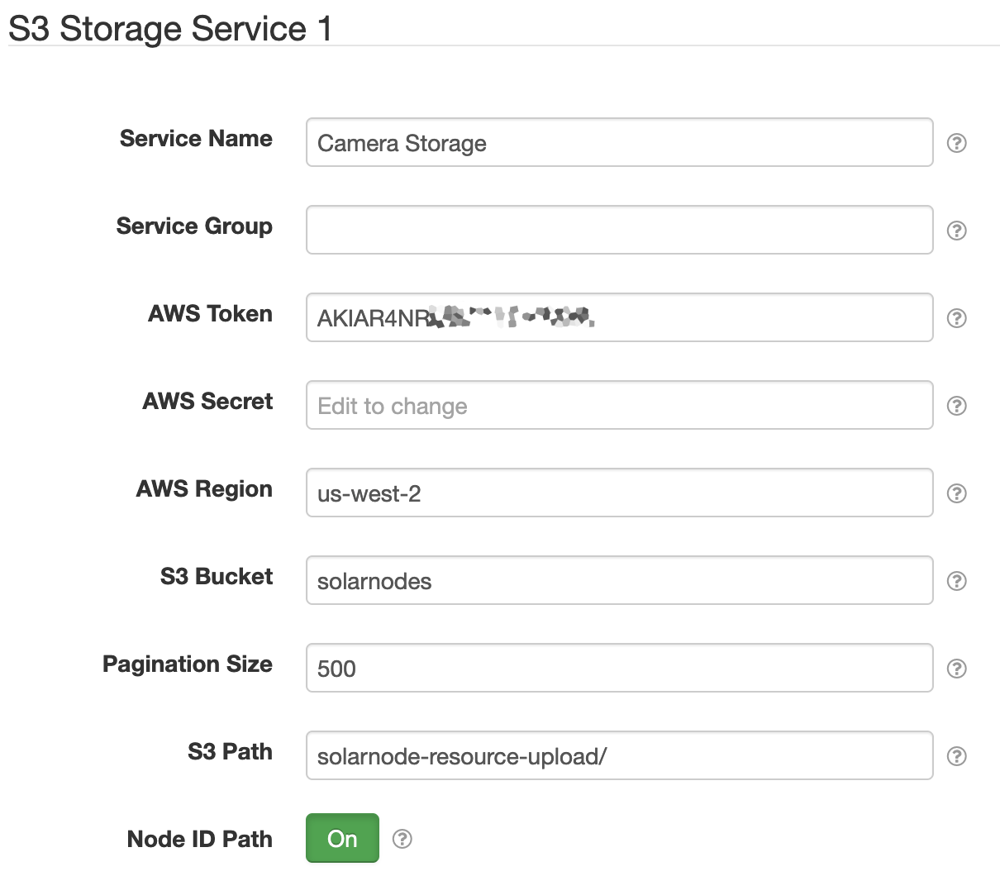

# SolarNode App - S3 Storage

This directory contains support for building the `solarnode-app-storage-s3` package. This
provides support for SolarNode to store resources in S3, such as images captured from a camera.
See [CHANGELOG](./CHANGELOG.md) for release information.

## S3 Storage Service component

Here's an example of an S3 Storage Service configuration for uploading camera photos to S3,
such as those captured with the [solarnode-app-camera-ffmpeg](../../solarnode-app-camera-ffmpeg/debian)
package.

# Example auto settings

See the [solarnode-app-storage-s3.csv](./example/etc/solarnode/auto-settings.d/solarnode-app-storage-s3.csv)
auto settings file as an example of SolarNode auto settings that can be copied to the
`/etc/solarnode/auto-settings.d` in SolarNodeOS to have an S3 Storage Service configured when
SolarNode starts.

# Building

You must clone the [solarnetwork-build][sn-build] repository in this directory (or make a symlink
to it).

Then you can run `make` to build the package, which will produce
`solarnode-app-storage-s3_VERSION_all.deb` in this directory.

[sn-deploy]: https://github.com/SolarNetwork/solarnetwork-build/tree/master/solarnode-deploy/generic
[sn-build]: https://github.com/SolarNetwork/solarnetwork-build/
