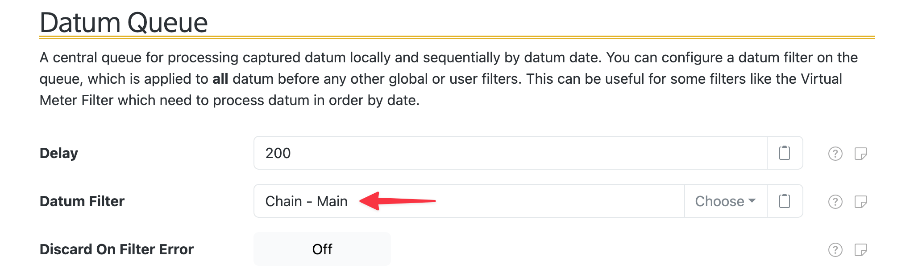
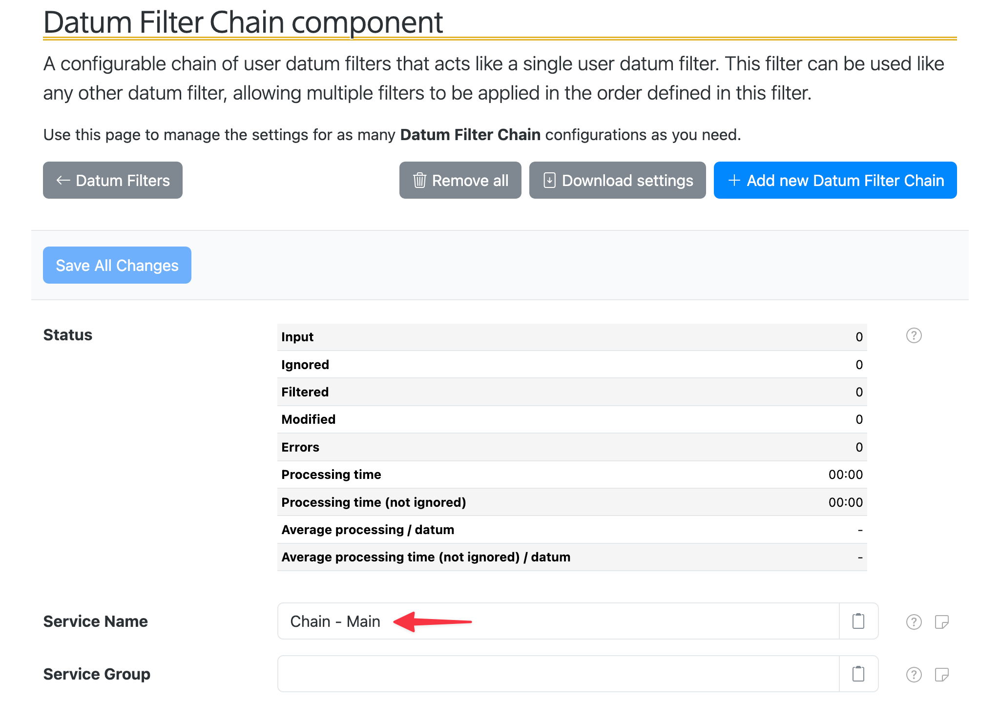

# SolarNode Configuration - Datum Filters

This directory contains support for building the `solarnode-config-datumfilters` package. This
provides standard configuration for core Datum Filters support in SolarNode.

> :warning: You might need to restart SolarNode **twice** after installing this package: first to
> have the configuration populated and then a second time to ensure the configuration is loaded.
> Be sure to wait for SolarNode to fully start before the second restart.

## Datum Queue Main Filter Chain

This configures an empty [Filter Chain][fc] named **Chain - Main** with the identifier `Main`, and
then configures the [Datum Queue][dq] to use this as the queue filter. This is a standard method of
configuring SolarNode filters, as detailed on the [Main Filter Chain recipe][mfcr].

The Datum Queue settings end up looking like this:

The `Main` Filter Chain settings end up looking like this:

## Building

Run `make` to build the package.

[dq]: https://solarnetwork.github.io/solarnode-handbook/users/datum-filters/#datum-queue
[fc]: https://solarnetwork.github.io/solarnode-handbook/users/datum-filters/chain/
[mfcr]: https://solarnetwork.github.io/solarnode-handbook/recipes/datum-filters/main-filter-chain/
